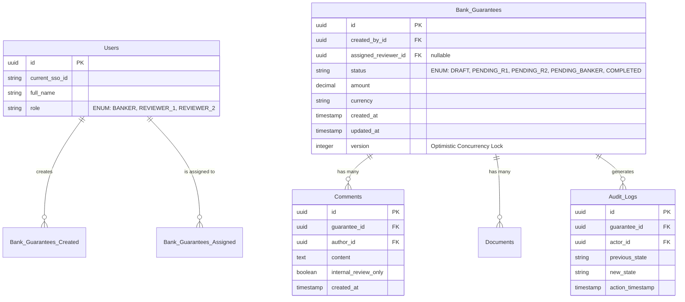

# System Design: Bank Guarantee Workflow Application (Westpac)

This document outlines the high-level architecture and system design for the internal **Bank Guarantee** application, a multi-role, state-machine-driven workflow system built during the 3-year Node.js backend developer simulation.

---

## 1. High-Level Architecture Overview

The system is built as a set of decoupled microservices centered around a BFF (Backend-For-Frontend) aggregator. It utilizes an event-driven architecture for asynchronous tasks (notifications, reports) while maintaining strict ACID compliance for core state transitions.

```mermaid
graph TD
    %% Frontend Clients
    BankerUI[Banker React SPA] -->|GraphQL / REST| API_Gateway
    ReviewerUI[Reviewer React SPA] -->|GraphQL / REST| API_Gateway

    %% Gateway & Auth
    API_Gateway[API Gateway / Ingress\n+ SSO JWT Validation] --> BFF[Node.js / Apollo BFF Aggregator]

    %% Microservices Layer
    BFF -->|gRPC / REST| CoreService[Bank Guarantee Core Service\nNode.js / NestJS]
    BFF -->|gRPC / REST| DocService[Document Vault Service]
    BFF -->|gRPC / REST| AuditService[Audit & Reporting Service]

    %% Databases
    CoreService -->|TypeORM| PrimaryDB[(PostgreSQL\nPrimary - Write Heavy)]
    AuditService -->|Mongoose| AuditDB[(MongoDB\nAnalytical Replicas)]
    DocService -->|Multipart Upload| AWS_S3[(Internal AWS S3)]
    DocService -->|gRPC| ClamAV[ClamAV Scanner]

    %% Event Streaming
    CoreService -->|Publish Events| KafkaQueue[[Kafka Event Stream\n(GuaranteeAssigned, StatusChanged)]]
    KafkaQueue -->|Consume| NotificationService[Email Notification Worker]
    KafkaQueue -->|Consume| PDFWorker[PDF Gen Worker]
```

---

## 2. Core Components

### 2.1 Backend-For-Frontend (BFF) Aggregator
*   **Technology:** Node.js, Apollo GraphQL.
*   **Purpose:** The central entry point for the React frontends. It prevents the frontend from making dozens of API calls by aggregating data (Guarantee Details, Comments, User Profiles, Associated Documents) into single, tailored payloads.
*   **Logic:** Implements `dataloader` to solve N+1 query problems when fetching user details for long lists of guarantees.

### 2.2 Bank Guarantee Core API (The State Machine)
*   **Technology:** Node.js, NestJS, TypeORM.
*   **Purpose:** The brain of the application. It handles the strict business constraints and workflow transitions (e.g., `DRAFT` $\rightarrow$ `PENDING_R1` $\rightarrow$ `COMPLETED`).
*   **Logic:**
    *   **RBAC Middleware:** Intercepts every request, extracts the user role from the SSO JWT, and blocks unauthorized horizontal access (e.g., Bankers trying to hit Reviewer endpoints).
    *   **Atomic Transactions:** Wraps database state updates and audit log inserts inside `BEGIN...COMMIT` blocks to prevent dirty reads and ensure compliance tracking.
    *   **Concurrency Control:** Utilizes Redis distributed locks (Checkout mechanism) to prevent two Reviewers from stepping on each other's toes.

### 2.3 Document Vault Service
*   **Technology:** Node.js Streams, AWS S3 SDK.
*   **Purpose:** Handles the uploading and secure retrieval of sensitive supporting documents (contracts, legal forms).
*   **Logic:**
    *   Instead of loading 20MB PDFs into Node.js memory, it streams multipart uploads directly into S3.
    *   Exposes short-lived Pre-Signed S3 URLs for downloads, but *only* successfully generates them if the core service verifies the requesting user has RBAC clearance for that specific file.
    *   Passes uploaded buffers to a ClamAV daemon container for malware scanning before allowing downstream access.

### 2.4 Event-Driven Workers
*   **Technology:** KafkaJS, Puppeteer.
*   **Purpose:** Offloads heavy, non-blocking tasks from the main API thread.
*   **Logic:**
    *   **Notification Worker:** Listens to `StatusChanged` events on Kafka and fires off internal Westpac emails (e.g., "You have a new Bank Guarantee to review").
    *   **PDF Generator:** When a guarantee transitions to `COMPLETED`, it consumes the finalized payload, renders an HTML template using Puppeteer, converts it to a stamped PDF, and uploads it to S3.

---

## 3. Database Schema Design (PostgreSQL)

The core relational database captures the strictly typed entities required for the state machine.



---

## 4. Key Design Decisions & Trade-offs

1.  **Relational SQL vs. NoSQL:**
    *   **Decision:** Chose **PostgreSQL** for the core guarantee engine.
    *   **Why:** Bank Guarantees require strict ACID compliance, heavy relational mapping (joining Guarantees to Users, Audits, and Comments), and complex status filtering. MongoDB would have struggled with multi-document atomic transactions spanning audits and state updates.
    *   *Note:* MongoDB was used as an eventual-consistency read-replica specifically tailored for Management Reporting.

2.  **State Machine in Code vs. Dedicated BPMN Tool (e.g., Camunda):**
    *   **Decision:** Built the state machine logic entirely in **Node.js/NestJS**.
    *   **Why:** While dedicated BPMN tools are powerful, this specific 5-step workflow was highly deterministic but required extreme custom JSON payload parsing and dynamic RBAC checks. Keeping it in Node.js reduced infrastructure complexity and latency.

3.  **Pessimistic vs. Optimistic Locking:**
    *   **Decision:** Used **both** depending on the scenario.
    *   **Why:** We used *Pessimistic Locking* (Redis Checkouts) to visibly lock the UI and stop Reviewers from wasting time reading a guarantee someone else is already reviewing. However, we used *Optimistic Locking* (Database `version` column) as the absolute safety net to catch "Lost Update" anomalies right at the database commit boundary.

4.  **REST vs. GraphQL:**
    *   **Decision:** Transitioned the Dashboard list endpoints to **GraphQL** in Year 3.
    *   **Why:** As the application grew, the frontend needed wildly different data shapes depending on the user's role. A Banker needed high-level summaries, while a Reviewer needed deep document metadata. GraphQL prevented massive data over-fetching payloads.
